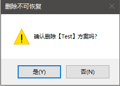
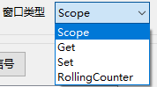
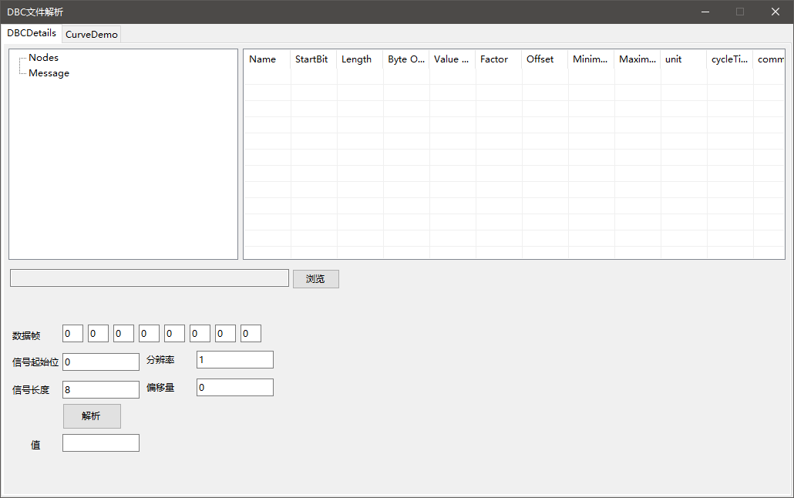
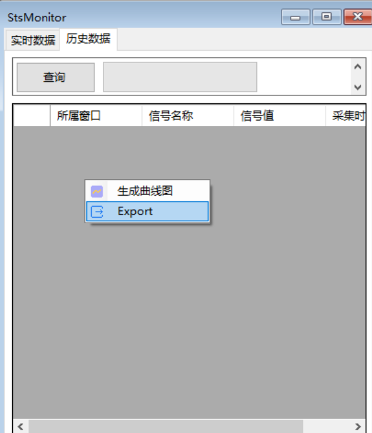
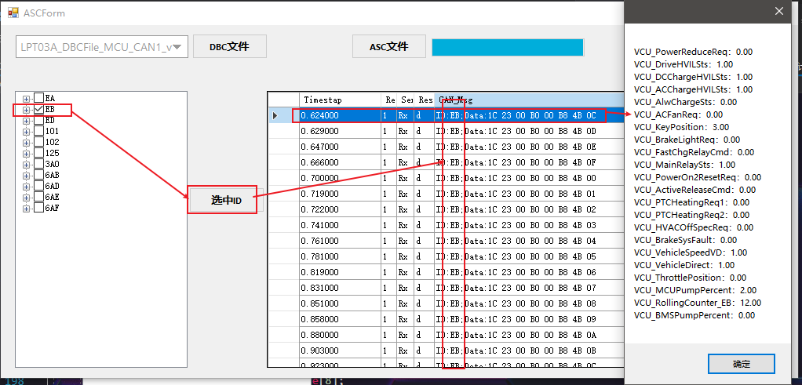

# 目录
<!-- vscode-markdown-toc -->
* 1. [版本记录](#)
* 2. [概念介绍(Intro)](#Intro)
	* 2.1. [方案（Project）](#Project)
	* 2.2. [窗口（Form）](#Form)
* 3. [基本使用(Use)](#Use)
	* 3.1. [~~启动窗口(Start)~~](#Start)
	* 3.2. [新建方案(Add Project)](#AddProject)
		* 3.2.1. [【新建方案】](#-1)
		* 3.2.2. [~~添加CAN通道~~](#CAN)
		* 3.2.3. [协议类型(Protocol)](#Protocol)
		* 3.2.4. [配置完成(Config Done)](#ConfigDone)
		* 3.2.5. [修改配置(Modified Config)](#ModifiedConfig)
		* 3.2.6. [删除配置(Delete Config)](#DeleteConfig)
	* 3.3. [增加窗口(Add Form)](#AddForm)
		* 3.3.1. [增加窗口(Add Form)](#AddForm-1)
		* 3.3.2. [编辑Form（Edit Form）](#FormEditForm)
		* 3.3.3. [删除Form（delete Form）](#FormdeleteForm)
	* 3.4. [Form介绍(Form Type)](#FormFormType)
		* 3.4.1. [Scope(~~Measure~~)](#ScopeMeasure)
		* 3.4.2. [Get](#Get)
		* 3.4.3. [Set](#Set)
		* 3.4.4. [RollingCounter](#RollingCounter)
	* 3.5. [Project Export/Import](#ProjectExportImport)
	* 3.6. [DBC文件解析](#DBC)
	* 3.7. [历史数据生产曲线图(History)](#History)
	* 3.8. [关闭软件(Close)](#Close)
	* 3.9. [ASC文件解析](#ASC)
	* 3.10. [A2L文件解析](#A2L)
	* 3.11. [XCP信号](#XCP)
		* 3.11.1. [界面(XCP Form)](#XCPForm)
		* 3.11.2. [DAQ](#DAQ)
		* 3.11.3. [波形回放(DAQHistory)](#DAQHistory)
* 4. [软件文件(Files)](#Files)
* 5. [Bug、建议反馈](#Bug)

<!-- vscode-markdown-toc-config
	numbering=true
	autoSave=true
	/vscode-markdown-toc-config -->
<!-- /vscode-markdown-toc -->
# 上位机使用说明

##  1. <a name=''></a>版本记录

| 版本号           | 发布/修改内容                                                | 发布人 | 时间       |
| ---------------- | ------------------------------------------------------------ | ------ | ---------- |
| V0.001.beta      | 上位机初版内测                                               | 徐卫东 | 2021-12-01 |
| V0.001.01-beta   | DBC协议发送小数会影响其他信号<br/>Set界面设置默认值0，增加步长 | 徐卫东 | 2021-12-02 |
| V0.001.02-beta   | USB2EU类型设置波特率失败；<br/>【Set】界面若取不到数据，设置数据为【--】 | 徐卫东 | 2021-12-02 |
| V0.001.03-beta   | 取消--【Set】界面若取不到数据，设置数据为【--】              | 徐卫东 | 2021-12-02 |
| V0.001.04-beta   | 修改增加方案的布局<br/> CAN通道支持删除<br/> CAN卡类型修改寄存器同步修改<br/> 修改增加窗口的布局<br/> Get、Measure、Set窗口修改布局<br/> Set窗口获取信号的最值，修改时判断最值 | 徐卫东 | 2021-12-08 |
| V0.001.05-beta   | 【Set】界面调整<br/>已创建的窗口支持增加信号，并添加查询信号<br/>增加历史曲线图<br/>增加【RollingCounter】界面 | 徐卫东 | 2021-12-21 |
| V0.001.06-beta   | 【Get】窗口debug代码为注释                                   | 徐卫东 | 2021-12-22 |
| V0.001.07-beta   | 软件界面增加新的模式，软件启动时选择模式<br/>测量变量排列方式优化<br/>【Set】界面增加回车发送，调整步长精度0->0.1，步长可增减<br/>调整测量变量在窗口大小改变时显示不完全的问题<br/>历史数据支持导出，并增加将导出的历史数据还原为曲线图的功能<br/>增加字体修改<br/>【Measure】添加坐标轴缩放 | 徐卫东 | 2022-01-07 |
| V0.001.08-beta   | RollingCounter发送问题，定时器改为Thread，UI控件不实时更新RollingCounter的值<br/>Measure界面接收数据和曲线描点分为两个定时器<br/>SignalInfoUS控件，添加SignalValue属性，减少UI控件的更改<br/>2E-U通道号没有保存，获取不到CAN1的数据问题修改<br/>Measure曲线和图例不对应问题修复<br/>获取数据定时器改为用Thread，Task死循环读取 | 徐卫东 | 2022-01-17 |
| V0.001.09-beta   | 2E-U发送CAN1数据失败                                         | 徐卫东 | 2022-01-21 |
| V0.001.10-beta   | SignalEntity结构调整，历史数据查询方式修改<br/>DBC窗口增加手动解析<br/>新增信号支持搜索ID号，选择的信号按照Message ID，StartBit排序，信号手动调整显示顺序<br/>新增自定义信号，点击信号可查看信号详细信息<br/>Measure改为Scope，曲线的点数开放<br/>单通道支持多个协议文档，协议文档更新后，Form中的信号自动更新<br/>软件增加图标 | 徐卫东 | 2022-02-24 |
| v0.001.11-beta   | CAN通道数量bug，现在固定通道<br />Scope界面增加多Y轴，CheckColor显示具体值<br />SignalControl支持输入负号<br />rollingcounter支持步长<br />修改日志模块<br />修复project的can类型与实际连接的不符导致的连接错误，修改类型后还是打开错误的问题<br />【Set】步长增加【乘】【除】 | 徐卫东 | 2022-04-01 |
| v0.001.11.1-beta | 软件退出时删除日志                                           | 徐卫东 | 2022-04-01 |
| v0.001.12-beta   | 退出软件时 提示删除日志，db数据库<br />增加存储数据功能开启，关闭<br />CAN Receive增加软件缓存 | 徐卫东 | 2022-04-07 |
| v0.002.01-beta   | 重设计Get/Set界面<br />主界面增加状态<br />修改提示框<br />增加记录打开窗口的大小和位置 |  徐卫东 | 2022-04-28   |
| v0.002.02-beta   | 曲线控件更改为ZedGraph<br />【set】【RollingCounter】界面中的【乘】、【除】禁用 <br />CANReceive改为事件委托<br /> rollingcounter界面修改，启动时检测CAN盒连接是否正常| 徐卫东 | 2022-06-21  |
| v0.002.03-beta   | 子窗口恢复最小化窗口<br />子窗口添加切换MDI模式<br />修改mdi子界面的样式<br /> 信号增加自定义名称<br />RollingCounter使用datagridview会有发送延时的问题，界面回滚<br />增加ASC文件解析窗口| 徐卫东 | 2022-08-11  |
| v0.002.04-beta   | 增加对zlgcan.dll的调用，支持CANFD-200U的数据收发<br />修复dbc'文件读取失败的bug<br />修复Scope界面在获取数据时修改信号会导致程序卡死的bug<br /> 修复修改信号界面，删除信号再重新添加相同的信号失败的bug<br />| 徐卫东 | 2022-10-26  |
| v0.002.05-beta   | 增加XCP模块（polling）<br />增加A2L文件解析<br />修复RollingCounter界面启动发送后，Get界面无法获取数据的Bug（zlgcan 使用自收自发后，can收不到新数据）<br /> Signal结构修改,projectItem结构修改<br />| 徐卫东 | 2023-01-12  |
| v0.003.01-beta   | 增加XCPDAQ模块<br />| 徐卫东 | 2023-03-07  |
| v0.003.03-beta   | 解析a2l转换成XCPSignal时，对变量的类型解析方式修改<br />修复Form CANchannel变化，XCP CANIndex=1时 连接失败，addnewform 添加信号失败的bug<br/>按钮图标更新<br/>增加数据保存，波形回放（内置数据）| 徐卫东 | 2023-03-15  |
注：该软件使用CAN的驱动版本为 ZLGCAN 2.2.0 ，若打开设备失败则安装对应版本驱动!


---

##  2. <a name='Intro'></a>概念介绍(Intro)

###  2.1. <a name='Project'></a>方案（Project）

基本结构，包含一些基本信息，方案内包含多个窗口，打开后连接CAN卡显示数据。

* 方案名称
* Can设备类型
* CAN口索引
* CAN通道（根据CAN类型自行增删）
  * 波特率
  * 协议类型（目前仅DBC协议）
  * 协议文档

###  2.2. <a name='Form'></a>窗口（Form）

数据显示窗口，分为四类：

* 示波器（Scope）~~Measure~~
* 实时获取数值（Get）
* 标定（Set）
* RollingCounter（XCP模式下不可用）
* XCP_DAQ(仅XCP模式下的Get)
* XCP_DAQScope(仅XCP模式下的Scope)

基本信息

* 窗口名称（不可重复）
* 窗口类型
* CAN口索引（获取信号信息的基础）
* 测量信号

---

##  3. <a name='Use'></a>基本使用(Use)

###  3.1. <a name='Start'></a>~~启动窗口(Start)~~

* ~~Root+Project: 方案信息与Project窗口合并在一个界面~~
* Root-Project:方案信息和Project窗口各自独立，但关闭方案信息界面会关闭所有打开的Project窗口


###  3.2. <a name='AddProject'></a>新建方案(Add Project)

####  3.2.1. <a name='-1'></a>【新建方案】

点击按钮，打开【新建方案】窗口，填写方案名称等基本信息


####  3.2.2. <a name='CAN'></a>~~添加CAN通道~~


V0.001.04-beta 增加删除通道


v0.001.11.beta 固定通道数

##### ~~、添加成功提示，通道协议配置区域可配置~~


####  3.2.3. <a name='Protocol'></a>协议类型(Protocol)


点击【通道启用】，选择协议类型（目前支持DBC，XCP协议。Excel协议选择后无法读取信号），选择协议文档，若没有符合的协议文档，可点击右侧【添加文档】导入协议文档。


*注：添加或修改通道协议配置一定要点击【通道配置保存】。*  

* DBC  
选择DBC协议文件  
* XCP  
填入主机，从机ID  
  
选择a2l文件  


####  3.2.4. <a name='ConfigDone'></a>配置完成(Config Done)

配置完成后，点击【确认】按钮，完成新建。【主界面】左侧也出现新的方案名称


####  3.2.5. <a name='ModifiedConfig'></a>修改配置(Modified Config)

树状图选择需要修改的方案，右键选择【Edit】，修改完后需要重新打开方案。


####  3.2.6. <a name='DeleteConfig'></a>删除配置(Delete Config)

树状图选择需要修改的方案，右键选择【Delete】



###  3.3. <a name='AddForm'></a>增加窗口(Add Form)

1）右键/双击打开Project，单独的Project界面


单独的Project界面


####  3.3.1. <a name='AddForm-1'></a>增加窗口(Add Form)


##### 选择窗口类型



##### 选择CAN口索引


##### 索引选择后，根据该索引配置的协议，解析协议文档，读取出测量信号

*XCP协议读取A2L文件需安装 java*


##### 选择需要测量的信号，点击【>】添加至右侧区域


##### 右侧【↑】【↓】可调整显示顺序（Scope窗口无效）注意选中整行

CustomName:自定义名称，可修改


##### 自定义信号

注：自定义信号的ID不能在dbc文件中


填写关键信息，点击确认

##### 点击【确认】，窗口添加完成。*添加后会自动打开*


####  3.3.2. <a name='FormEditForm'></a>编辑Form（Edit Form）

所有信息都可变


##### 3.4.2.1）Form打开时，增加信号，仅能修改信号


设置【速度】【转矩】自定义名称


##### 3.4.2.2）V0.001.12-beta 增加存储数据开关（Scope&Get窗口）


##### 3.4.2.3）V0.002.03-beta 增加MDI模式开关

选中时窗口在Project中，会随Project关闭，拖动时会卡顿
不选中时为单独的一个窗口，需要手动关闭


####  3.3.3. <a name='FormdeleteForm'></a>删除Form（delete Form）

树状图右键选择删除的Form，弹出确认框。点击确认删除Form。


点击确认后删除Form。

###  3.4. <a name='FormFormType'></a>Form介绍(Form Type)

####  3.4.1. <a name='ScopeMeasure'></a>Scope(~~Measure~~)


##### 3.5.1.1）实时数据

分为上中下三块

* 上

获取数据周期，单位为毫秒(ms)，点击【开始获取数据】，启动

【曲线点数】为该信号在左侧的曲线图上的最多点数

* 中

图例点击颜色块可修改该信号在曲线图上的显示颜色，打钩表示显示与否。

文本框实时显示数据。

* 下
  
启动时，该窗口内的报错显示在下放。仅显示最新的一条。

##### 3.5.1.2）~~历史数据~~ 弃用 from v0.002.02-beta

查询数据


选中历史数据查看曲线图


####  3.4.2. <a name='Get'></a>Get

新建窗口，选择窗口类型【Get】...


* Get窗口

信号名称；信号值


##### 2-2）~~调整获取周期~~ 点击【启动】，实时获取数据

##### ~~2-3）历史数据：同【Scope】窗口~~

####  3.4.3. <a name='Set'></a>Set


~~按照ID分组。~~

输入信号值后，点击【Send】，发送数据。

选择信号、输入步长，点击【加】【减】等按钮后修改信号值并发送数据。

####  3.4.4. <a name='RollingCounter'></a>RollingCounter

该窗口为读取协议中信号的周期，自动发送数据。

如下图DBC协议的中的cycletime：10ms


针对包含rollingcounter的信号名称，每次发送数据 Rollingcounter值+1，在【0，15】之间循环

若有checksum，固定认为checksum为起始位58，长度8的值*需要选择checksum，才会发送*

计算方式如下：

```C#
byte crc = 0;
for (UInt16 i = 0; i < 7; i++)
{
   crc = (byte)(crc + frame[0].w[i]);
}
crc = (byte)(crc ^ 0xff);
frame[0].w[7] = crc;
```

打开时，若CAN口打开，则启动发送数据定时器，可点击下方按钮停止/启动。

注：信号名称包含【checksum】【rolling】时，rollingcount和checksum才会自动计算


###  3.5. <a name='ProjectExportImport'></a>Project Export/Import

* 导出

将所有方案信息导出为Json格式文件

【Root-Project】


* 导入

将导出的Json文件导入。若当前软件中没有方案信息，则会增加。同名方案不会覆盖。


###  3.6. <a name='DBC'></a>DBC文件解析

验证DBC文件读取是否正确。

增加cycleTime


【Root-Project】




###  3.7. <a name='History'></a>历史数据生产曲线图(History)

【Get】、【Measure】界面历史数据中选择数据，export为Excel文件



在主界面中【其他】菜单中点击【HistoryMeasure】打开窗口


将刚刚导出的excel【Import】


###  3.8. <a name='Close'></a>关闭软件(Close)


* 若有未关闭的project会提示


7.2 提示保存配置文件

【Config/Project.json】


* 保存本次Log&数据库数据

【Log/...】&【Data/Measure.db】文件


---

###  3.9. <a name='ASC'></a>ASC文件解析


1.选择DBC文件
2.导入ASC文件
3.选中DBC信号，点击【选中信号】，右侧筛选信号
4.双击数据帧，根据DBC文件解析该数据帧


###  3.10. <a name='A2L'></a>A2L文件解析

a2l文件解析依靠jar包，需自行安装java  


  
1）【Modi addr】  
选中左侧elf信号点击【Modi addr】 根据Name更新【EcuAddress】  
2）【add to Meas】  
选中左侧信号添加到measure列表中
3）【add to char】  
选中左侧信号添加到character列表中
4）【Compu】&【Layout】  
目前不支持更改

###  3.11. <a name='XCP'></a>XCP信号

基础配置见[协议类型(Protocol)](#Protocol)

####  3.11.1. <a name='XCPForm'></a>界面(XCP Form)

* 主界面  


点击连接

连接成功后状态改变


若配置了多个CAN通道，连接xcp前先选择通道号（左下角）

* 数据界面
【Get】、【Set】、【Scope】  
界面与DBC相同，采用XCP polling模式采集数据
【RollingCounter】不可用

####  3.11.2. <a name='DAQ'></a>DAQ

DAQ模式下，需连接XCP才能修改信号（需要获取从机的事件通道）

*注：【XCP_DAQ】与【XCP_DAQScope】只能运行一个窗口*


* 【XCP_DAQ】
DAQ模式下的采集数据

* 【XCP_DAQScope】
DAQ模式下的曲线图


####  3.11.3. <a name='DAQHistory'></a>波形回放(DAQHistory)

DAQ窗口下，右键选择记录数据，后台开始记录（目前为数据库格式，仅能内部回放）

窗口中选择【历史数据】界面


选择起止时间，点击查询（查询时避免同时也在记录数据）


选择信号，右键选择【生成曲线图】


##  4. <a name='Files'></a>软件文件(Files)


* Config
  * 保存方案信息（Json）
  * 日志结构
* Data
  * 存储历史数据
* DBC
  * 导入的dbc协议文档
* kerneldlls
  * Can卡通讯相关
* Log
  * 日志文件
* Data
  * 获取数据后存储的历史数据
* BouncyCastle.Crypto.dll
  * NPOI依赖项
* ControlCAN.dll
  * can卡通讯
* ICSharpCode.Sharp.Ziplib.dll
  * NPOI依赖项
* log4net.dll
  * 日志相关，丢失后，日志模块
* Newtonsoft.Json.dll
  * Json文件读写
* NPOI.dll、NPOI.OOXML.dll...等
  * 历史数据导入导出为Excel的依赖项
* OxyPlot.dll、OxyPlot.WindowsForms.dll
  * 曲线图控件
* SQLite-net.dll、SQL...、
  * 历史数据存储相关

##  5. <a name='Bug'></a>Bug、建议反馈

请将Bug截图，复现步骤，日志文件打包发送。

联系人：徐卫东

联系电话：615090

联系邮箱：xu_weidong@leapmotor.com
