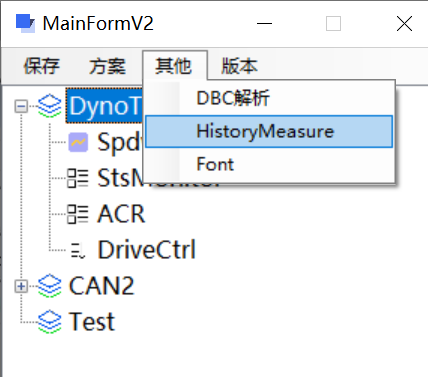

# 上位机使用说明

## 版本记录

| 版本号         | 发布/修改内容                                                | 发布人 | 时间       |
| -------------- | ------------------------------------------------------------ | ------ | ---------- |
| V0.001.beta    | 上位机初版内测                                               | 徐卫东 | 2021-12-01 |
| V0.001.01-beta | DBC协议发送小数会影响其他信号<br/>Set界面设置默认值0，增加步长 | 徐卫东 | 2021-12-02 |
| V0.001.02-beta | USB2EU类型设置波特率失败；<br/>【Set】界面若取不到数据，设置数据为【--】 | 徐卫东 | 2021-12-02 |
| V0.001.03-beta | 取消--【Set】界面若取不到数据，设置数据为【--】              | 徐卫东 | 2021-12-02 |
| V0.001.04-beta | 修改增加方案的布局<br/> CAN通道支持删除<br/> CAN卡类型修改寄存器同步修改<br/> 修改增加窗口的布局<br/> Get、Measure、Set窗口修改布局<br/> Set窗口获取信号的最值，修改时判断最值 | 徐卫东 | 2021-12-08 |
| V0.001.05-beta | 【Set】界面调整<br/>已创建的窗口支持增加信号，并添加查询信号<br/>增加历史曲线图<br/>增加【RollingCounter】界面 | 徐卫东 | 2021-12-21 |
| V0.001.06-beta | 【Get】窗口debug代码注释                                     | 徐卫东 | 2021-12-22 |
| V0.001.07-beta | 软件界面增加新的模式，软件启动时选择模式<br/>测量变量排列方式优化<br/>【Set】界面增加回车发送，调整步长精度0->0.1，步长可增减<br/>调整测量变量在窗口大小改变时显示不完全的问题<br/>历史数据支持导出，并增加将导出的历史数据还原为曲线图的功能<br/>增加字体修改<br/>【Measure】添加坐标轴缩放 | 徐卫东 | 2022-01-07 |

注：该软件使用CAN的驱动版本为 ZLGCAN 2.2.0 ，若打开设备失败则安装对应版本驱动


## 一、概念介绍

### 1、方案（Project）

基本结构，包含一些基本信息，方案内包含多个窗口，打开后连接CAN卡显示数据。

- 方案名称
- Can设备类型
- CAN口索引
- CAN通道（根据CAN类型自行增删）
  - 波特率
  - 协议类型（目前仅DBC协议）
  - 协议文档

### 2、窗口（Form）

数据显示窗口，分为四类：

- 示波器（Measure）
- 实时获取数值（Get）
- 标定（Set）
- RollingCounter

基本信息

- 窗口名称（不可重复）
- 窗口类型
- CAN口索引（获取信号信息的基础）
- 测量信号

---

## 二、基本使用

### 0、启动窗口

- Root+Project: 方案信息与Project窗口合并在一个界面
- Root-Project:方案信息和Project窗口各自独立，但关闭方案信息界面会关闭所有打开的Project窗口


### 1、新建方案

1）、点击按钮，打开【新建方案】窗口，填写方案名称等基本信息。


2）、添加CAN通道


V0.001.04-beta 增加删除通道


2.1）、添加成功提示，通道协议配置区域可配置：


点击【通道启用】，选择协议类型（目前只有DBC协议。Excel协议选择后无法读取信号），选择协议文档，若没有符合的协议文档，可点击右侧【添加文档】导入协议文档。

*注：添加或修改通道协议配置一定要点击【通道配置保存】。* 

3）、配置完成后，点击【确认】按钮，完成新建。【主界面】左侧也出现新的方案名称。


4）、修改配置

树状图选择需要修改的方案，右键选择【修改Project】，修改完后需要重新打开方案。


5）删除配置

树状图选择需要修改的方案，右键选择【删除Project】


### 2、增加窗口

1）双击【测试方案】*新建的方案名称*，右侧出现工作区域。


单独的Project界面


2）增加窗口

2.1) 点击【NewForm】，填写窗口名称


2.2) 选择窗口类型


2.3) 选择CAN口索引


2.4) 索引选择后，根据该索引配置的协议，解析协议文档，读取出测量信号


2.5) 选择需要测量的信号，点击【>】添加至右侧区域


2.6) 点击【确认】，窗口添加完成。*添加后会自动打开*


左侧目录结构中同步更新。


3）、删除Form，树状图右键选择删除的Form，弹出确认框。点击确认删除Form。


点击确认后删除Form。

### 3、Form介绍

#### 1）Measure


1-1）实时数据

分为上下两块

1-1-1） 上方分为曲线图和图例

图例点击颜色块可修改该信号在曲线图上的显示颜色，打钩表示显示与否。

1-1-2） 下方

获取数据周期，单位为毫秒(ms)，点击【开始获取】，启动

启动时，该窗口内的报错显示在左侧。仅显示最新的一条。

如下图所示：【CAN口未打开】，需点击【StartCAN】启动连接CAN。


1-2）历史数据

查询数据


选中历史数据查看曲线图


#### **2）Get**

新建窗口，选择窗口类型【Get】...


2-1）Get窗口

信号名称；信号值；~~信号单位；信号当前状态*（目前还未正确显示，可忽略）*~~


2-2）调整获取周期，点击【AutoGet】，实时获取数据。

2-3）历史数据：同【Measure】窗口

#### **3）Set**


按照ID分组。

输入信号值后，点击【Set】或者回车，发送数据。

选择信号、输入步长，点击add后自动增加信号值并发送数据。


#### 4）RollingCounter

该窗口为读取协议中信号的周期，自动发送数据。

如下图DBC协议的中的cycletime：10ms


针对包含rollingcounter的信号名称，每次发送数据 Rollingcounter值+1，在【0，15】之间循环

若有checksum，固定认为checksum为起始位58，长度8的值

计算方式如下：

```C#
byte crc = 0;
for (UInt16 i = 0; i < 7; i++)
{
   crc = (byte)(crc + frame[0].w[i]);
}
crc = (byte)(crc ^ 0xff);
frame[0].w[7] = crc;
```

打开时默认就启动发送数据定时器，可点击下方按钮停止/启动。


### 4、Project导入导出

4.1）导出

将所有方案信息导出为Json格式文件


4.2）导入

将导出的Json文件导入。若当前软件中没有方案信息，则会增加。同名方案不会覆盖。


### 5、DBC文件解析

验证DBC文件读取是否正确。

增加cycleTime


### 6、历史数据生产曲线图

【Get】、【Measure】界面历史数据中选择数据，export为Excel文件


在主界面中【其他】菜单中点击【HistoryMeasure】打开窗口



将刚刚导出的excel【Import】


## 三、软件文件


- Config
  - 保存方案信息（Json）
  - 日志结构
- Data
  - 存储历史数据
- DBC
  - 导入的dbc协议文档
- kerneldlls
  - Can卡通讯相关
- Log
  - 日志文件
- Data
  - 获取数据后存储的历史数据
- ControlCAN.dll
  - can卡通讯
- log4net.dll
  - 日志相关，丢失后，日志模块
- Newtonsoft.Json.dll
  - Json文件读写 
- OxyPlot.dll、OxyPlot.WindowsForms.dll
  - 曲线图控件
- SQLite-net.dll、SQL...、
  - 历史数据存储相关

## 四、Bug、建议反馈

请将Bug截图，复现步骤，日志文件打包发送。

联系人：徐卫东

联系电话：615090

联系邮箱：xu_weidong@leapmotor.com